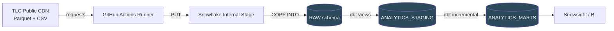

# NYC Yellow Taxi Analytics Pipeline

An end to end ELT pipeline that ingests NYC Taxi & Limousine Commission trip records into Snowflake, models them with dbt into a tested star schema, and runs on a monthly schedule with zero managed infrastructure.

Roughly 9.5 million trips loaded, modelled, and tested. Total compute cost is under one Snowflake credit per month on an XSMALL warehouse.

---

## Architecture



| Layer | Objects | Materialization | Purpose |
|---|---|---|---|
| `RAW` | `RAW_YELLOW_TRIPS`, `RAW_TAXI_ZONES` | table | Untouched source data plus lineage columns |
| `ANALYTICS_STAGING` | `STG_YELLOW_TRIPS`, `STG_TAXI_ZONES` | view | Renaming, typing, filtering, deduplication |
| `ANALYTICS_MARTS` | `FCT_TRIPS`, `DIM_ZONES` | incremental / table | Star schema for consumption |

### Stack

**Snowflake** (warehouse, internal stages, COPY INTO) · **dbt Core 1.12** (dbt-snowflake) · **GitHub Actions** (scheduled orchestration) · **Python 3.11** (snowflake-connector-python) · **Parquet** (source format)

---

## Why these choices

### Serverless orchestration over a hosted scheduler

The first design used Airflow in Docker. That works, but a laptop hosted scheduler only runs when the laptop runs, and the DAG for this pipeline is one task with one dependency. GitHub Actions gives a real cron on infrastructure that stays up, and standard runners are free on public repositories.

The tradeoff is honest: no dependency graph, no backfill semantics, no lineage UI. If this pipeline grew to a dozen interdependent sources, Airflow (or Snowflake Tasks) would be the right call. At one source it is not.

Backfills are handled through a `workflow_dispatch` input rather than a catchup mechanism:

```yaml
workflow_dispatch:
  inputs:
    month:
      description: 'YYYY-MM to load (blank = auto)'
```

Running the same workflow with `2024-01` through `2024-05` produced the historical load. The scheduled path leaves the input blank and computes a target month two months behind the current date, because TLC publishes on roughly a two month lag.

### Internal stages over S3

Snowflake internal stages are backed by Snowflake managed cloud storage and require no external account, no IAM policy, and no bucket lifecycle rules. External stages are the right answer when the data already lives in your own bucket or another team owns it. Here the source is a public CDN, so an S3 hop would add a component without adding capability.

### Key pair authentication

Snowflake blocks password authentication for programmatic connections on new accounts. The runner authenticates with an RSA key pair: the private key lives in GitHub Actions secrets, the public key is registered on the Snowflake user with `ALTER USER ... SET RSA_PUBLIC_KEY`.

The same script runs locally and in CI without a code change, because credentials are read from the environment and the key loader accepts either a file path (local) or the key contents (CI):

```python
key_path = os.environ.get("SF_PRIVATE_KEY_PATH")
raw = open(key_path, "rb").read() if key_path else os.environ["SF_PRIVATE_KEY"].encode()
```

`profiles.yml` follows the same principle. Every value is an `env_var()` reference, so the file is safe to commit and CI needs no secret file generation step.

---

## Ingestion

`PUT` is a client side command, so it cannot run from a Snowsight worksheet or through a generic SQL operator. It has to go through a Snowflake driver, which is why ingestion is a Python script rather than pure SQL.

```
download → PUT (internal stage) → COPY INTO → REMOVE staged file
```

The `COPY INTO` uses an explicit column transform rather than `MATCH_BY_COLUMN_NAME`, for two reasons.

**Lineage.** The transform clause allows `METADATA$FILENAME`, which populates `_source_file` on every row. Combined with a `_loaded_at` default, every record traces back to the file and batch that produced it. These two columns turn out to be load bearing later.

**Schema drift.** TLC changes column casing between releases. `Airport_fee` in some files, `airport_fee` in others. One `COALESCE` handles it at the point of ingestion:

```sql
COALESCE($1:Airport_fee, $1:airport_fee)
```

### Parquet timestamps arrive as integers

Extracting a Parquet timestamp through `$1:column` yields a VARIANT holding raw microseconds since epoch. The Parquet logical type is lost, so a direct cast produces dates in the year 54,000,000. The fix is an explicit scale:

```sql
TO_TIMESTAMP_NTZ($1:tpep_pickup_datetime::NUMBER, 6)
```

The `6` is microsecond precision. This affected every row, not a handful, and it was caught by a min/max sanity check on the first load rather than by anything downstream.

### Permissive raw types

`passenger_count` and `RatecodeID` are conceptually integers but are typed `FLOAT` in the raw table, because TLC's Parquet physical types shift across years. A raw layer whose job is to always load, with casting deferred to staging, avoids the failure mode where a type change in a source file breaks ingestion at 3am. Strictness belongs downstream, where it can be tested.

---

## Transformation

### Incremental strategy

`FCT_TRIPS` is incremental. The obvious configuration is `unique_key='trip_key'` with the default `merge` strategy, and it fails:

```
Duplicate row detected during DML action
```

Snowflake's `MERGE` refuses to run when the source contains repeated key values, and TLC data contains genuine duplicate trips: same vendor, same timestamps, same zones, same fare.

The working configuration keys on the batch instead of the row:

```sql
{{
    config(
        materialized='incremental',
        incremental_strategy='delete+insert',
        unique_key='_source_file'
    )
}}
```

Each load is one month and one file, which makes `_source_file` the natural batch unit. `delete+insert` then means "remove this file's rows and write them again", which is idempotent regardless of how many times it runs. New batches are identified by the lineage column:

```sql

where _loaded_at > (
    select coalesce(max(_loaded_at), '1900-01-01'::timestamp_ltz)
    from {{ this }}
)

```

A rerun with no new data completes in about four seconds and writes zero rows. A rerun after a new month writes roughly 3.4 million.

Worth being precise about what this saves. `STG_YELLOW_TRIPS` is a view, so the raw table is still scanned in full on every run. The saving is entirely on the write side. Materializing staging as a table would move the saving upstream at the cost of storage and an extra build step.

### Reload safety

`COPY INTO` maintains load history for 64 days and skips files it has already ingested, which sounds like idempotency for free. It is not, quite. Load history keys on file path **and** ETag. A pipeline that removes the staged file after loading and re-uploads with `OVERWRITE=TRUE` creates a new object with a new ETag, and Snowflake treats it as a new file.

The staging layer is therefore written to be immune to reloads rather than to trust the loader:

```sql
qualify _loaded_at = max(_loaded_at) over (partition by _source_file)
```

One line, and the latest batch per file wins. A file can be loaded any number of times and the models are unaffected. The loader also checks for existing rows before uploading, with a `FORCE_RELOAD` escape hatch, but the `QUALIFY` is the guarantee and the check is the optimization.

This is the standard "latest batch wins" deduplication pattern and it generalizes well beyond this project.

### Surrogate keys without a natural key

TLC provides no trip identifier. `trip_key` is an MD5 hash over the attributes that should uniquely identify a trip:

```sql
md5(vendor_id || '|' || pickup_at || '|' || dropoff_at || '|'
    || pickup_zone_id || '|' || total_amount)
```

Collisions in this key are not hash collisions. They are real records that are identical across all five attributes, which is a data question rather than a modelling one. Documenting the collision rate and deciding deliberately is more defensible than widening the key until the `unique` test passes.

### Left joins on dimensions

Zone IDs 264 and 265 mean "unknown" and appear on a meaningful number of trips. An inner join to `DIM_ZONES` would silently drop them, which is the wrong behavior for a fact table: an unknown pickup zone is not a reason to discard a fare. Both joins are `LEFT`, and the `relationships` test is defined on the dimension side.

---

## Data quality

The staging layer filters to plausible trips:

```sql
where pickup_at >= '2024-01-01'
  and pickup_at <  '2025-01-01'
  and dropoff_at > pickup_at
  and trip_distance_miles > 0
  and total_amount > 0
```

Measured over five months of 2024:

| | Rows |
|---|---:|
| Raw | 9,554,778 |
| After staging filters | 9,232,810 |
| **Filtered** | **321,968 (3.4%)** |

The categories overlap, so they do not sum to the total:

- Timestamps outside the loaded year (meters with bad clocks, some reading 2002)
- Dropoff at or before pickup
- Zero or negative trip distance, usually the largest bucket
- Non positive fare totals, mostly refunds and voided trips

A filter rate is only useful if you know what it consists of. "I cleaned the data" is not an answer; "3.4% dropped, mostly zero distance meter events, here is the breakdown query" is.

### Tests

`dbt build` runs models and tests together in dependency order.

| Model | Column | Test |
|---|---|---|
| `dim_zones` | `zone_id` | `unique`, `not_null` |
| `dim_zones` | `borough` | `accepted_values` |
| `fct_trips` | `trip_key` | `not_null` |
| `fct_trips` | `pickup_at` | `not_null` |
| `fct_trips` | `total_amount` | `not_null` |
| `fct_trips` | `pickup_zone_id` | `relationships` to `dim_zones` |

`unique` is deliberately absent on `trip_key`. Adding it would force a dedupe that hides a real property of the source data. The collision rate is measured and documented instead.

---

## Micro-partitions and pruning

Snowflake stores every table as a set of immutable micro-partitions, each holding on the order of 50 to 500 MB of uncompressed data in columnar form. There is no user defined partitioning scheme. Snowflake maintains metadata per micro-partition per column, including value ranges, distinct counts, and null counts, and the optimizer uses that metadata to skip partitions that cannot satisfy a predicate.

This matters here because trips arrive one month per file, in chronological order. Load order becomes natural clustering, and `pickup_at` predicates prune well without any explicit configuration.

Inspecting it:

```sql
select system$clustering_information('ANALYTICS_MARTS.FCT_TRIPS', '(PICKUP_AT)');
```

The useful fields are `average_overlaps` (how many partitions share a value range with a given partition) and `average_depth` (how many partitions must be read for a point lookup). Lower is better on both.

Measuring actual pruning on a real query:

```sql
select
    query_text,
    partitions_scanned,
    partitions_total,
    round(100 * (1 - partitions_scanned / nullif(partitions_total, 0)), 1) as pct_pruned,
    bytes_scanned,
    total_elapsed_time
from snowflake.account_usage.query_history
where query_type = 'SELECT'
  and partitions_total > 0
order by start_time desc
limit 20;
```

A date filtered query on a naturally ordered table should show most partitions skipped. A query filtering on `payment_type` or `pickup_zone_id` will not prune, because those values are scattered across every partition.

**On clustering keys.** Nine million rows is a few hundred megabytes compressed, which is a small number of micro-partitions. An explicit clustering key would trigger automatic reclustering, which consumes serverless credits continuously, in exchange for pruning that natural load order already provides. Snowflake's own guidance is that clustering keys pay off on tables in the multi terabyte range with a selective, frequently filtered column. Adding one here would cost money to solve a problem that does not exist.

Knowing when not to reach for a feature is worth as much as knowing how to use it.

### Zero copy clones and Time Travel

Two Snowflake behaviors that change how you work:

```sql
-- an instant, storage-free copy of the entire schema
create schema ANALYTICS_MARTS_SANDBOX clone ANALYTICS_MARTS;

-- read the table as it was before the last run
select count(*) from FCT_TRIPS at(offset => -3600);
```

Clones share micro-partitions with the source and only diverge on write. This makes "test the migration on production sized data" a one second operation rather than a copy job. Time Travel makes a bad load recoverable with `UNDROP` or `CREATE TABLE ... CLONE ... AT`, which removes most of the fear from `TRUNCATE`.

---

## Analytics

A few queries the model was built to answer.

**Tipping by borough and payment method**

```sql
select
    pickup_borough,
    payment_method,
    count(*)                        as trips,
    round(avg(tip_pct_of_fare), 1)  as avg_tip_pct,
    round(avg(total_amount), 2)     as avg_fare
from fct_trips
where payment_method in ('Credit card', 'Cash')
group by 1, 2
having count(*) > 1000
order by 1, 2;
```

Cash tips read as near zero across every borough. This is not driver behavior, it is a recording artifact: cash tips never enter the meter. Any tip analysis that does not filter to card payments is measuring the wrong thing, and the difference is large enough to invert conclusions.

**Congestion by hour and borough**

```sql
select
    pickup_borough,
    pickup_hour,
    round(avg(avg_speed_mph), 1) as mph,
    count(*)                     as trips
from fct_trips
where is_weekend = false
  and avg_speed_mph between 1 and 60
group by 1, 2
order by 1, 2;
```

The speed bounds matter. Unbounded, a handful of records with sub second durations produce averages in the thousands of miles per hour and destroy the aggregate.

**Airport trip economics**

```sql
select
    rate_type,
    count(*)                          as trips,
    round(avg(trip_distance_miles), 2) as avg_miles,
    round(avg(trip_duration_minutes), 1) as avg_minutes,
    round(avg(total_amount), 2)        as avg_total
from fct_trips
where rate_type in ('Standard', 'JFK', 'Newark')
group by 1
order by 2 desc;
```

---

## Repository layout

```
.
├── .github/workflows/
│   └── tlc_monthly_load.yml     Scheduled load and transform
├── sql/
│   └── 00_setup.sql             One time DDL: warehouse, stage, raw tables
├── scripts/
│   ├── load_tlc.py              Download, PUT, COPY INTO, cleanup
│   └── load_zone.py             One off zone dimension load
├── dbt/
│   ├── dbt_project.yml
│   ├── profiles.yml             All env_var references, safe to commit
│   └── models/
│       ├── staging/
│       │   ├── source.yml
│       │   ├── stg_yellow_trips.sql
│       │   └── stg_taxi_zones.sql
│       └── marts/
│           ├── schema.yml       Tests
│           ├── fct_trips.sql    Incremental
│           └── dim_zones.sql
└── requirements.txt
```

---

## Running it

**Prerequisites:** a Snowflake account, Python 3.11+, and an RSA key pair registered on your Snowflake user.

```bash
# 1. Snowflake objects (once, in Snowsight)
#    Run sql/00_setup.sql

# 2. Environment
python3 -m venv venv && source venv/bin/activate
pip install -r requirements.txt

cat > .env <<'EOF'
SF_ACCOUNT=YOURORG-YOURACCOUNT
SF_USER=YOUR_USER
SF_ROLE=SYSADMIN
SF_WAREHOUSE=LOAD_WH
SF_PRIVATE_KEY_PATH=rsa_key.p8
EOF

# 3. Load a month
TARGET_MONTH=2024-01 python3 scripts/load_tlc.py

# 4. Transform
cd dbt
export DBT_PROFILES_DIR=~/.dbt
dbt build
```

**In CI:** add `SF_ACCOUNT`, `SF_USER`, `SF_PRIVATE_KEY`, `SF_ROLE`, and `SF_WAREHOUSE` as repository secrets. The workflow runs on the 3rd of each month and can be triggered manually with a target month for backfills.

### Cost control

- XSMALL warehouse, 1 credit per hour, billed per second after a 60 second minimum
- `AUTO_SUSPEND = 60` set explicitly. The default is 600 seconds, which is where trial credits disappear
- Staged files removed after load so they do not accrue storage
- Five months of trips is well under 1 GB, so storage is a rounding error

```sql
select warehouse_name, sum(credits_used) as credits
from snowflake.account_usage.warehouse_metering_history
where start_time >= dateadd(day, -30, current_timestamp())
group by 1;
```

---

## Things that went wrong

Kept deliberately, because the failures were more instructive than the successes.

**Parquet timestamps decoded as seconds instead of microseconds.** Every row wrong, dates in the year 54,000,000. Caught by a min/max check on the first load. Nothing downstream would have flagged it, because the values were valid timestamps, just absurd ones.

**A month loaded three times.** CI runs failed at the dbt step while succeeding at the load step, and each retry re-ingested the same file. `COPY INTO` load history did not prevent it, because the file was removed and re-uploaded between runs, changing its ETag. Diagnosed by noticing that "duplicate" rows differed only in `_loaded_at`, which is the entire argument for keeping that column. Fixed structurally with the `QUALIFY` deduplication rather than by cleaning up the data.

**`SUCCESS 0` is ambiguous.** An incremental model that correctly finds no new data and one whose upstream step silently failed produce identical output. Exit codes are not a substitute for asserting row counts.

**Dependency pins fought each other.** Pinning `snowflake-connector-python` and `python-dotenv` independently of `dbt-core` produced an unsolvable resolution on a clean install, while the local environment kept working because packages had been installed incrementally. Only CI caught it. Pin the thing you care about, let the resolver handle its dependencies.

---

## Possible extensions

- Materialize staging as a table so incremental savings apply to reads as well as writes
- Add a second source (weather, for example) through a managed connector, so the project demonstrates tool selection per source rather than one tool everywhere
- Snowflake Streams and Tasks as a zero infrastructure alternative to the Actions scheduler, building the same pipeline both ways
- `dbt source freshness` checks and a row count assertion after each load
- Green taxi and for hire vehicle datasets, which share zone dimensions but differ in schema

---

## Data source

[NYC Taxi & Limousine Commission trip records](https://www.nyc.gov/site/tlc/about/tlc-trip-record-data.page), published monthly on a roughly two month lag.
